# RetroGPT

RetroGPT is an open-source project that bridges the gap between retro computing and modern AI capabilities. It allows vintage systems like DOS, OS/2, Windows 9x, and early Linux distributions to interact with GPT-3 and other large language models through a relay server. This project aims to provide real-time AI assistance on retro hardware, preserving the nostalgic experience while leveraging cutting-edge technology.

## Key Features
- **Retro Client Support**: Compatible with DOS, OS/2, Windows 9x, NT 4.0, and early Linux distributions.
- **Hybrid Communication**: Supports both TCP/IP and serial communication for maximum compatibility.
- **Modular Design**: Easily extendable to support new platforms and protocols.
- **Secure and Isolated**: Uses a relay server to maintain network security and control.

## Architecture Summary
RetroGPT consists of the following components:
- **Retro Clients**: Lightweight clients running on vintage systems, sending prompts to the relay server.
- **Relay Server**: A modern server that handles requests from retro clients, communicates with GPT-3 or other LLMs, and returns responses.
- **Serial and TCP Support**: Clients can communicate with the relay server over TCP/IP or serial connections, depending on their capabilities.

## Supported Platforms
- **DOS**: Using serial communication.
- **OS/2**: Using serial communication.
- **Windows 9x**: Using TCP/IP.
- **Windows NT 4.0**: Using TCP/IP.
- **Linux**: Slackware 96, Red Hat 5.1, and similar distributions using TCP/IP.

## Architecture Diagram

```mermaid
flowchart LR
    subgraph Retro_Network [Retro Network]
        TerminalClient["🖥️ Terminal Client (BBS-style)"]
        DOSClient["💾 DOS Client"]
        OS2Client["📀 OS/2 Client"]
        Win32Client["🪟 Win32 Client"]
        LinuxClient["🐧 Retro Linux Client"]
    end

    subgraph Main_Network [Main Network]
        RelayServer["🧠 RetroGPT Relay Server"]
        OpenAI["☁️ OpenAI API"]
    end

    Firewall["🧱 Firewall"]

    TerminalClient -- Serial 🔵 --> Firewall
    DOSClient -- Serial 🔵 --> Firewall
    OS2Client -- Serial 🔵 --> Firewall
    Win32Client -- TCP 🟢 --> Firewall
    LinuxClient -- TCP 🟢 --> Firewall

    Firewall --> RelayServer
    RelayServer -- HTTPS 🔴 --> OpenAI
```

